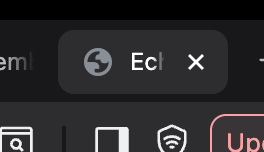

<div align="center">



# EchoBrief AI

**Turn meetings into memory.** EchoBrief ingests audio, produces transcripts, summaries, and action items, and gives you natural-language Q&A across everything you have captured—so decisions and follow-ups stay findable long after the call ends.

*This repository ships the **web app** (TanStack Start + React), a **Node.js API** (Hono), and a **BullMQ worker** that runs transcription, embeddings, and analysis.*

</div>

---

## Architecture

| Piece | Runtime | Role |
|--------|---------|------|
| **Web** | TanStack Start (SSR) → Cloudflare Worker (`wrangler`) | UI and server-rendered routes |
| **API** | Node 20 (`src/api.ts`) | REST API at `/api/v1` — meetings, chat, search, integrations |
| **Worker** | Node 20 (`src/server/workers/main.ts`) | Queued jobs: transcribe, embed, analyze |
| **Postgres** | Railway (or any Postgres) | App data, vectors, migrations in `/migrations` |
| **Redis** | Railway (or any Redis) | BullMQ queues |
| **Object storage** | Cloudflare R2 (S3-compatible) | Audio uploads |

Production layout is documented in [RAILWAY.md](./RAILWAY.md): API and worker share one Docker image with different start commands; the frontend deploys separately to Cloudflare.

---

## Prerequisites

- **Node.js 20+** (matches the API Docker image)
- **PostgreSQL** and **Redis** URLs you can reach from your machine (for local dev, Railway’s public proxy URLs are fine)
- Optional: **Wrangler** CLI for Cloudflare deploys (`npm i -g wrangler` or use `npx`)

---

## Local development

### 1. Install dependencies

```bash
npm ci
```

### 2. Environment

Copy the example file and fill in values (at minimum `DATABASE_URL`, `REDIS_URL`, and `BETTER_AUTH_SECRET` — see comments in the file):

```bash
cp .dev.vars.example .env
```

`src/api.ts` and the worker load config via `dotenv` from `.env`. For Cloudflare-only variables during Worker dev/build, follow your TanStack / Wrangler workflow; backend secrets for API and worker stay in `.env`.

### 3. Database migrations

```bash
npm run migrate
```

Requires `DATABASE_URL` to be set. Migrations live in `migrations/` and are applied in order.

### 4. Run processes

You typically want **three terminals**:

| Terminal | Command | Purpose |
|----------|---------|---------|
| 1 | `npm run dev:api` | Hono API (`PORT` from `.env`, default `3000`) |
| 2 | `npm run dev:worker` | BullMQ consumer for async processing |
| 3 | `npm run dev` | Vite + TanStack Start (frontend) |

If the UI and API both try to bind to the same port, set a different `PORT` in `.env` for the API (for example `4000`) and point the client at that base URL wherever your app reads the API origin.

Health check for the API process:

```bash
curl -s http://localhost:${PORT:-3000}/ | jq .
```

API routes are mounted at **`/api/v1`**.

---

## Scripts

| Script | Description |
|--------|-------------|
| `npm run dev` | Frontend dev server (TanStack Start + Vite) |
| `npm run dev:api` | API with `tsx` watch |
| `npm run dev:worker` | Worker with `tsx` watch |
| `npm run build` | Production build for the web app |
| `npm run build:api` | Compile API + worker to `dist-api/` (`tsc -p tsconfig.api.json`) |
| `npm run start:api` | Run compiled API: `node dist-api/api.js` |
| `npm run start:worker` | Run compiled worker: `node dist-api/server/workers/main.js` |
| `npm run migrate` | Apply SQL migrations |
| `npm run typecheck` | TypeScript check |
| `npm run lint` | ESLint |
| `npm run format` | Prettier |

---

## AI and integrations (env overview)

Backend expectations are validated in `src/server/env.ts`. Highlights:

- **OpenAI** — LLM and embeddings (`OPENAI_API_KEY`, optional model overrides).
- **AssemblyAI** — transcription (`ASSEMBLYAI_API_KEY`).
- **Resend** — transactional email (`RESEND_API_KEY`).
- **R2** — S3-compatible audio storage (`R2_*` variables).
- **Better Auth** — `BETTER_AUTH_SECRET` (32+ characters); optional Google OAuth.
- **Integrations** — Notion / Linear / Google OAuth client IDs where applicable; `INTEGRATION_TOKEN_ENCRYPTION_KEY` for stored tokens.

See [`.dev.vars.example`](./.dev.vars.example) for a complete checklist with generation hints.

---

## Deployment

- **API + worker (Railway):** [RAILWAY.md](./RAILWAY.md) — Dockerfile, two services, shared secrets, internal vs proxy database URLs.
- **Frontend (Cloudflare):** `wrangler.jsonc` points at `src/server.ts`; deploy with your usual `wrangler deploy` flow after `npm run build`.

---

## Product and engineering docs

| Document | Contents |
|----------|----------|
| [PRD.md](./PRD.md) | Product vision, features, user flows, API overview |
| [TECHSTACK.md](./TECHSTACK.md) | Stack choices and rationale |
| [USE_CASES.md](./USE_CASES.md) | Detailed scenarios |
| [USER_SCREENS.md](./USER_SCREENS.md) | Screen-level behavior |

---

## Project layout (high level)

```
src/
  api.ts                 # Node API entry (Hono on @hono/node-server)
  server.ts              # TanStack / Cloudflare SSR entry
  server/
    api/                 # Hono routes, middleware
    db/                  # Postgres access
    services/            # OpenAI, AssemblyAI, Redis, queue, R2, email, …
    workers/             # BullMQ worker entry + job handlers
  routes/                # TanStack Router file-based routes (UI)
migrations/              # SQL migrations
scripts/                 # migrate, API build helpers
```

---

## Contributing

Use `npm run typecheck` and `npm run lint` before opening a PR. Keep API changes in sync with `src/server/api/` and any new migrations in `migrations/`.

This package is **private** (`package.json`); adjust licensing and contribution guidelines if you open-source it later.
